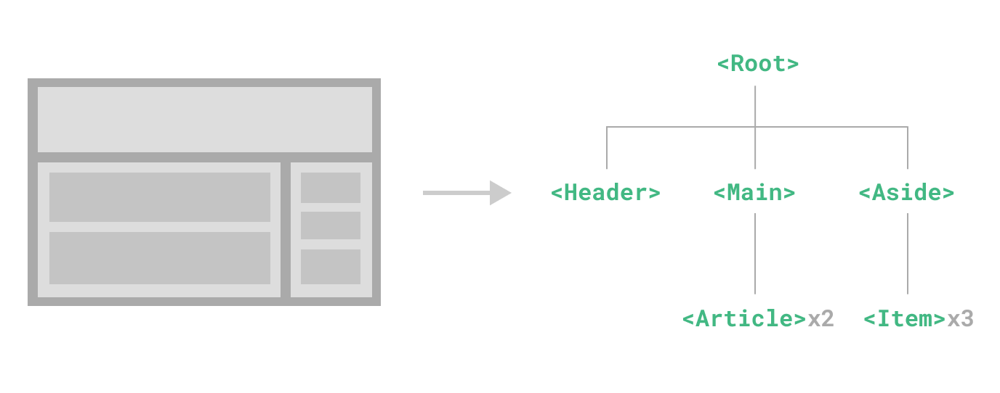

# 基于 Vue 的前端组件化开发

组件化是现代前端开发的核心思想之一。在 Vue 中，组件是可复用的 Vue 实例，具有名称，例如**PostCard**。我们可以通过创建新组件将这些组件作为自定义元素（类似于HTML中的一个标签）来使用。在实际应用中，组件常常被组织成一个层层嵌套的树状结构，如图所示：


<!-- more -->
## 1.什么是组件化开发

组件化开发是一种将 UI 拆分成独立、可复用的组件的开发方式。每个组件包含：

- **模板（Template）**：定义组件的结构
- **逻辑（Script）**：处理组件的行为
- **样式（Style）**：定义组件的外观

组件化的优势：

1. **可复用性**：组件可以在不同地方重复使用
2. **可维护性**：每个组件互相独立，便于维护和更新
3. **可组合性**：可以通过组合简单组件来构建复杂界面
4. **提升开发效率**：团队成员可以并行开发不同组件，互不干扰，减少沟通成本

## 2.组件的导出、导入、注册与调用

### 2.1.组件的调用

1. 导入组件
在使用组件之前，首先需要导入组件。通常使用 ES6 的 import 语法：
::: tabs
@tab 相对路径
``` js
import PostCard from './PostCard.vue';
```
@tab 路径别名
``` js
//根据项目配置，也可能使用路径别名
import PostCard from '@components/PostCard';
```
:::

2. 注册组件
导入组件后，需要将其注册到当前组件中才能使用。有两种注册方式：
::: tabs
@tab 局部注册
``` js
//在组件的 components 选项中注册：
export default {
  name: 'PostList',
  components: {
    PostCard
  },
  // ...其他选项
}
```
@tab 全局注册
``` js
//在 Vue 应用实例上全局注册组件，这样所有组件都可以使用该组件：
import { createApp } from 'vue';
import PostCard from './PostCard.vue';

const app = createApp({});
app.component('PostCard', PostCard);
```
:::
3. 引用组件
注册后，就可以像HTML的一个标签似的在模板中使用组件了：
``` vue
<template>
  <div>
    <PostCard />
  </div>
</template>
```
### 2.2.组件的导出
  在 Vue 中，组件导出是组件开发的重要环节。组件必须正确导出才能被其他组件导入和使用。主要有以下几种导出方式：
::: tabs
@tab 默认导出
这是最常用的导出方式，每个 Vue 组件文件通常只有一个默认导出
``` js
// PostCard.vue
export default {
  name: 'PostCard',
  props: {
    post: {
      type: Object,
      required: true
    }
  },
  // 组件的其他选项...
}
```
@tab 命名导出
命名导出导出多个组件或功能
``` js
export const PostCard = {
  name: 'PostCard1',
  // 组件选项...
}

export const PostList = {
  name: 'PostCard2',
  // 组件选项...
}
// 导入时需要使用解构语法
// import { PostCard1, PostCard2 } from './PostCard.js'
```
@tab 混合导出
一个文件中可以同时有默认导出和命名导出：
``` js
// MyComponents.js
export const HelperFunction = () => {
  // 辅助函数
}

export const UtilityMixin = {
  // mixin
}

export default {
  name: 'MyComponent',
  // 主要组件
}

// 导入需要用到解构语法
// import MyComponent, { HelperFunction, UtilityMixin } from './MyComponents.js'
```
:::

***完整的组件导出结构***

实际开发中按需导出即可

``` vue
<script>
export default {
  // 1. 组件名称
  name: 'ComponentName',
  // 2. 组件依赖:本组件中用到的其他组件
  components: {
    ChildComponent
  },
  // 3. 属性定义：显式声明它所接受的 props
  props: {
    // 属性验证确保组件接口的健壮性
    title: {
      type: String,
      required: true
      default: '默认标题'
    },
    posts: {
      type: Array,
      default: () => [] 
    }
  },
  // 4. 数据属性
  data() {
    return {
      // 组件内部状态
      loading: false
    }
  },
  // 5. 计算属性
  computed: {
    // 常用来描述依赖响应式状态的复杂逻辑
  },
  // 6. 监听器
  watch: {
    // 监听属性变化
  },
  // 7. 生命周期钩子
  created() {
    // 组件实例创建后调用
  },
  mounted() {
    // 组件挂载到 DOM 后调用
  },
  // 8. 方法定义
  methods: {
    handleClick() {
      // 处理点击事件
      this.$emit('click');
    }
  }
}
</script>
```

## 3.组件应用案例

### 3.1 基础组件示例

本博客本质上就是一个基于 Vue 的单页面应用，下面为大家演示一个简单的博客文章卡片组件：

<PostCard :post="{title: 'Vue组件化开发实践', excerpt: '深入探讨Vue中的组件化开发思想和实践方法', date: '2025-08-10', author: '带着黄昏出逃',link:'./2.html',image:'./image/2/image.png'}" />

该博客文章卡片源码如下:

```vue
<template>
  <div class="post-card">
    <!-- 文章卡片的图片部分，如果文章有图片则显示 -->
    <div class="post-card-image" v-if="post.image">
      <!-- 使用v-bind动态绑定图片的src和alt属性 -->
      
    </div>
    <!-- 文章卡片的内容部分 -->
    <div class="post-card-content">
      <!-- 文章标题 -->
      <h3 class="post-card-title">{{ post.title }}</h3>
      <!-- 文章摘要，如果存在则显示 -->
      <p class="post-card-excerpt" v-if="post.excerpt">{{ post.excerpt }}</p>
      <!-- 文章元信息区域 -->
      <div class="post-card-meta">
        <!-- 文章发布日期 -->
        <span class="post-card-date">{{ formatDate(post.date) }}</span>
        <!-- 文章作者，如果存在则显示 -->
        <span v-if="post.author" class="post-card-author"
          >by {{ post.author }}</span
        >
      </div>
      <!-- 阅读更多链接 -->
      <a :href="post.link" class="post-card-link">阅读更多</a>
    </div>
  </div>
</template>

<script>
// 导出组件定义
export default {
  // 组件名称
  name: 'PostCard',
  // 组件接收的属性:父组件调用子组件时传入具体数据
  props: {
    post: {
      // Post属性类型为对象
      type: Object,
      // 本属性为必需
      required: true,
      // 自定义验证函数，验证必需的属性
      validator(value) {
        return typeof value.title === 'string' && value.title.length > 0;
      }
    }
  },
  // 组件方法
  methods: {
    // 格式化日期的方法
    formatDate(dateString) {
      const options = { year: 'numeric', month: 'long', day: 'numeric' });
      return new Date(dateString).toLocaleDateString('zh-CN', options);
    }
  }
}
</script>
<style>
// 略
</style>
```

### 3.2 组件列表示例

该示例通过复用多个 **博客文章卡片** 实现文章列表的简单展示。

<div style="border-style: solid; border-width: 2px; border-color: #96fffd;">
  <PostList />
</div>


该博客文章列表源码如下：

```vue
<template>
  <!-- 根元素：使用div容器包装整个博客文章列表 -->
  <div class="post-list">
    <h2 class="post-list-title">博客文章</h2>
    <div class="post-list-container">
      <!-- 使用v-for指令遍历posts数组，为每个文章创建一个PostCard组件 -->
      <!-- :key属性用于Vue的虚拟DOM diff算法，提高渲染性能 -->
      <!-- :post属性将单个文章数据传递给PostCard组件 -->
      <PostCard
        v-for="post in posts"
        :key="post.id"
        :post="post"
        class="post-list-item"
      />
    </div>
  </div>
</template>

<script>
// 导入PostCard组件
import PostCard from "./PostCard.vue";

// 默认导出Vue组件配置对象
export default {
  // 本组件名称
  name: "PostList",
  // 注册子组件，使PostCard可以在模板中使用
  components: {
    PostCard,
  },
  // 定义组件的数据属性
  data() {
    // 返回一个对象，包含所有PostCard组件所需的所有响应式数据
    return {
      // posts数组包含所有要显示的博客文章信息
      posts: [
        {
          id: 1, // 文章唯一标识符
          title: "Vue组件化开发实践",
          excerpt:
            "深入探讨Vue中的组件化开发思想和实践方法，以及如何构建可复用的组件。",
          date: "2025-08-10",
          author: "带着黄昏出逃",
          link: "/posts/vue3/2.html",
        },
        // 略
      ],
    };
  },
};
</script>
```

### 3.3 带搜索功能的组件列表

<div style="border-style: solid; border-width: 2px; border-color: #96fffd;">
<SearchablePostList />
</div>
该示例只是在上一个示例的基础上增加计算属性**computed**来描述筛选的响应式状态的逻辑处理，篇幅所限不再附着代码

## 4.组件通信

Vue 组件之间可以通过以下方式进行通信：

### 4.1. Props（父组件向子组件传递数据）

::: tabs
@tab 父组件

```vue
<!-- 在父组件中调用子组件，并绑定给子组件所需的属性数据 -->
<template>
  <PostCard
    :post="{
      title: '文章标题',
      excerpt: '文章摘要内容',
      date: '2025-08-10',
      author: '作者名',
    }"
  />
</template>
<script setup>
import PostCard from "@components/PostCard";
export default {
  // 本组件名称
  name: "PostList",
  // 注册子组件，使PostCard可以在模板中使用
  components: {
    PostCard,
  },
};
</script>
```

@tab 子组件

```vue
<!-- 定义子组件，其中props为父组件传递的数据 -->
<template>
  <div>{{ post.title }}</div>
</template>

<script>
export default {
  name: "PostCard"
  // 需要父组件传递过来的数据
  props: ["post"],
};
</script>
```
:::
通常情况下，当我们需要从父组件向子组件传递数据时，会使用 props。想象一下这样的结构：有一些多层级嵌套的组件，形成了一棵巨大的组件树，而某个深层的子组件需要一个较远的祖先组件中的部分数据。在这种情况下，如果仅使用 props 则必须将其沿着组件链逐级传递下去，这会非常麻烦：


注意，虽然这里的**Footer**组件可能根本不需要这些 props，但为了使**DeepChild**能访问到它们，仍然需要定义并向下传递。如果组件链路非常长，可能会影响到更多这条路上的组件。这一问题被称为“prop 逐级透传”，显然是我们希望尽量避免的情况。
> [!tip]
> 具体如何解决该问题，我有空再说~

### 4.2. Events（子组件向父组件传递消息）

::: tabs
@tab 子组件

```vue
<!-- 子组件 -->
<template>
  <!-- 用v-on指令(简写为 @)来监听DOM事件
  在click事件触发时执行对应的transfer方法 -->
  <button @click="transfer()" />
</template>
<script>
export default {
  methods: {
    //定义点击方法
    transfer() {
      //子组件向父组件传递信息的关键方法！！！
      this.$emit("custom-event", data);
      //'custom-event'是自定义事件名，data 是要传递给父组件的数据
    },
  },
};
</script>
```

@tab 父组件

```vue
<!-- 在父组件设置事件监听 -->
<template>
  <!-- 用v-on指令(简写为 @)来监听DOM事件
  在custom-event事件触发时执行对应的handleEvent方法 -->
  <PostCard @custom-event="handleEvent" />
</template>
<script setup>
handleEvent(){
// 略
}
</script>
```

:::

## 5.总结

组件化开发是 Vue 的核心特性之一，它让前端开发变得更加模块化和可维护。通过将界面拆分为独立的组件，我们可以：

- 提高代码的可复用性
- 降低系统的耦合度
- 提升开发效率
- 便于团队协作

在实际项目中，合理地划分组件边界和设计组件接口是组件化开发的关键。

<script setup>
import PostCard from "@PostCard";
import PostList from "@PostList";
import SearchablePostList from "@SearchablePostList";

</script>
