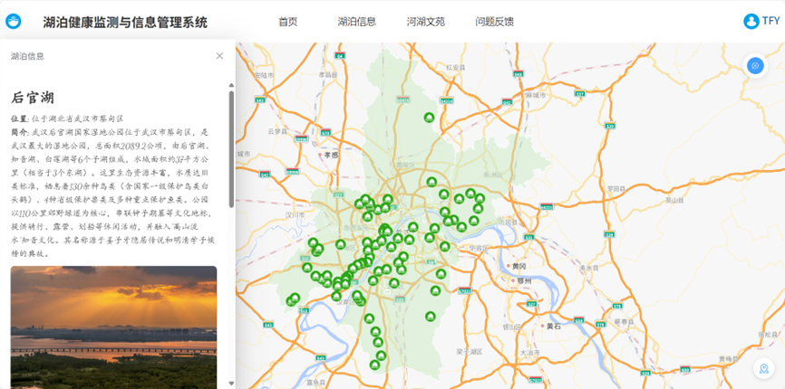
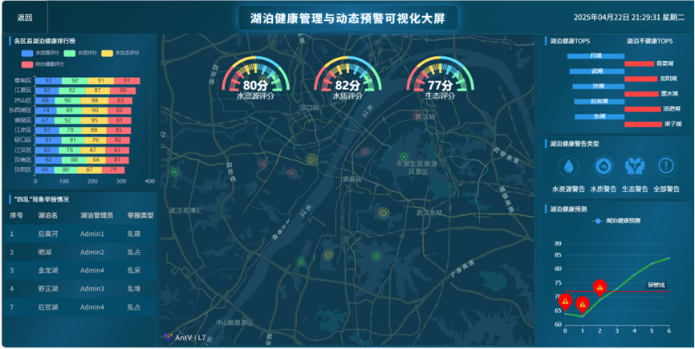

# 基于 WebGIS 的湖泊健康管理与动态预警平台
该系统融合物联网、WebGIS 及人工智能技术。采用 B/S 架构，前后端分离，以 Spring Boot 和 Vue 为核心框架，用 MySQL 存储属性数据、PostgreSQL（PostGIS 扩展）存储空间数据。功能上，实现湖泊信息实时管理与可视化（高德地图、AntV L7、ECharts），通过 EW-TOPSIS 法综合评价湖泊健康，基于 LSTM 模型预测健康状况并动态预警，集成 DeepSeek 模型提供专业解答，支持公众举报“四乱”现象，旨在实现湖泊健康监测、评价、预警及公众参与治理

